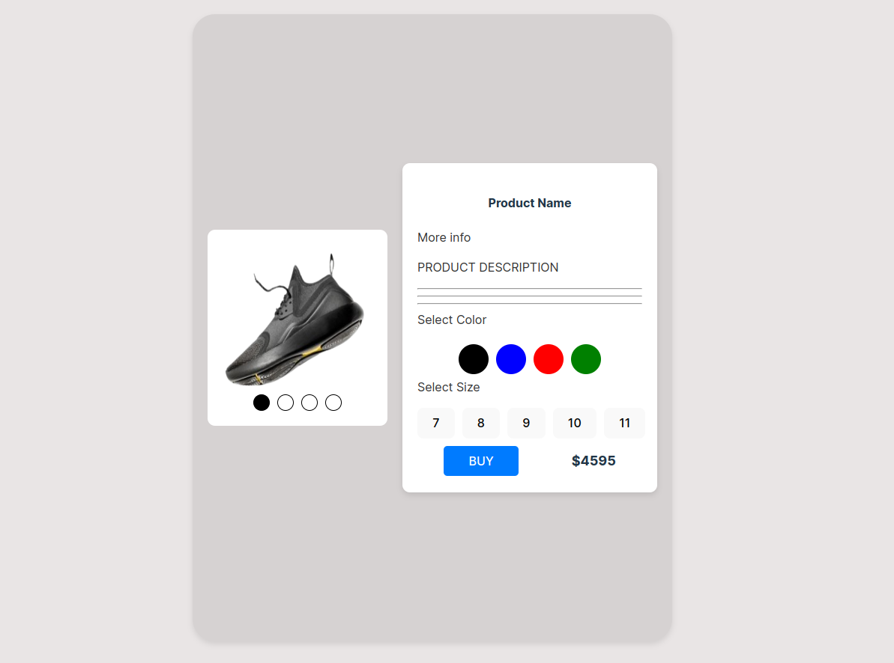

## Main Components
ShoeType: Shows the shoe image and color options.
ProductsWrapper: Wraps the product’s name and details.
ShoeDetails: Handles color/size selection and shows the price and "Buy" option.

## Running the project
1. Clone the repository and navigate to the project directory.
2. Run `pnpm install` to install the dependencies.
3. Run npm run dev to start the development server.
4. Open http://localhost:5173 in your browser to view the app.

## The interface of the product app
The app displays a list of shoes with their details. Each shoe has a name, image, color options, and a "Buy" button. The user can select the color and size of the shoe and click the "Buy" button to purchase it.

